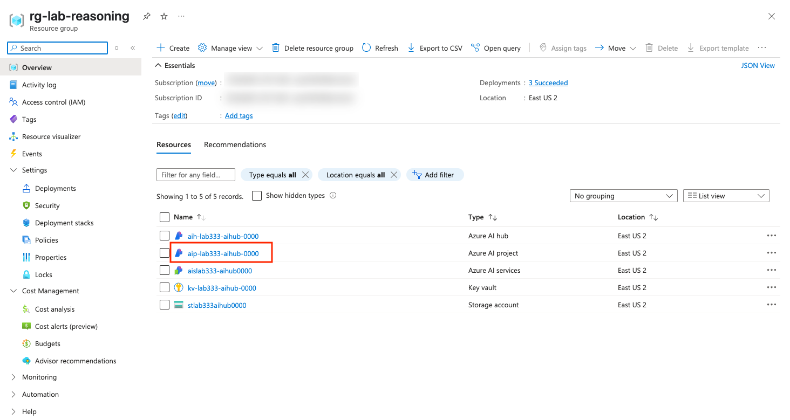
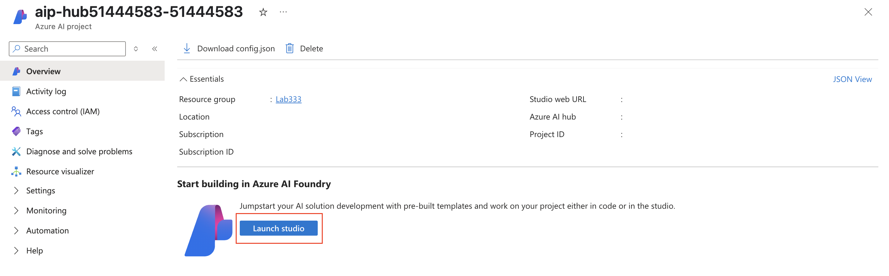
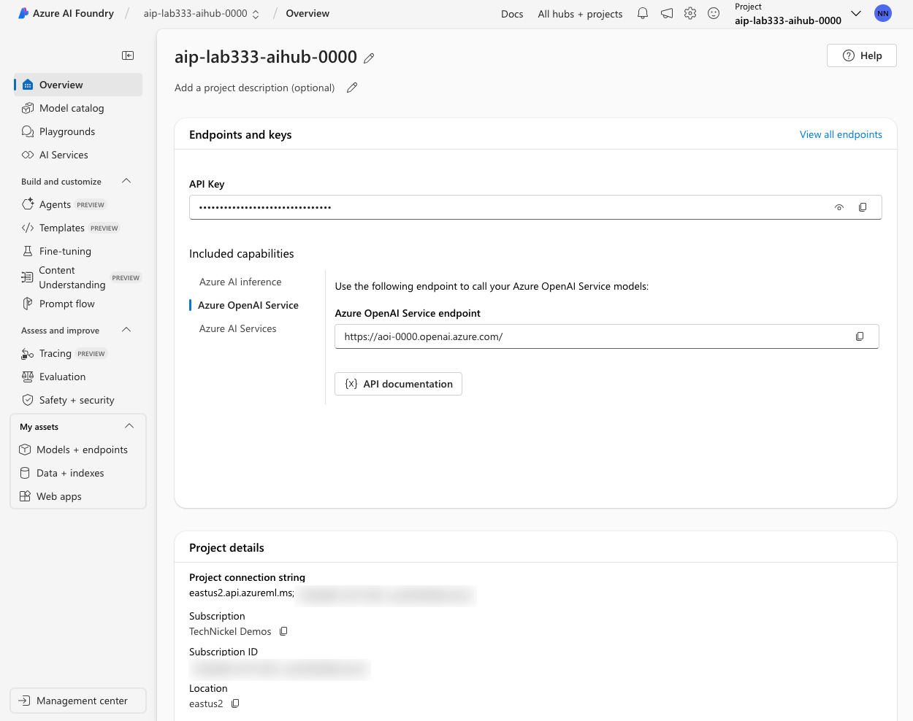
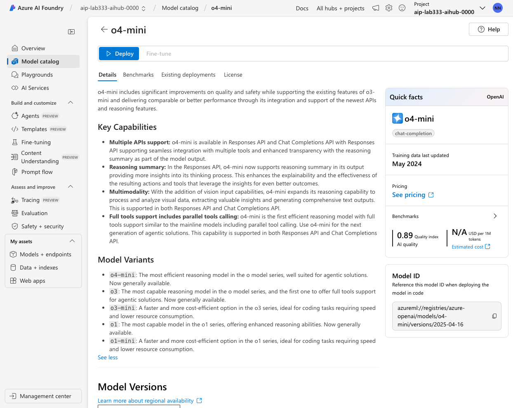

# Lab 2: Validate Setup

!!! quote "BY THE END OF THIS LAB YOU SHOULD HAVE"

    1. Accessed Azure Portal and verified resources were provisioned
    1. Accessed Azure AI Foundry portal and verified models were deployed
    1. Activated the Azure AI Foundry playground for future use

---

## 1. Log into Azure Portal

**The Azure Portal** is the web-based interface for managing Azure resources. It provides a unified view of all your Azure resources, including those provisioned by Azure AI Foundry. 

To log into the Azure portal, you will need an Azure subscription. **Pick a tab below**.

=== "In-Venue Attendees"

    You will be using the Azure subscription provided by the Skillable lab environment.

    1. Visit [this Azure Portal link](https://portal.azure.com/#browse/resourcegroups) in a new browser tab.   
    1. You will be prompted to log in.
    1. Switch to the browser tab with the Skillable VM
        - Look for the Azure Credentials in the instructions pane
        - Copy the `Username`. Switch to the Azure Portal tab and paste it.
        - Switch to Skillable tab. Copy the `Password` for the credential.
        - Switch to Azure Portal tab. Paste it and complete auth flow. 

=== "At-Home Attendees"

    You will be using your own Azure subscription.

    1. Visit [this Azure Portal link](https://portal.azure.com/#browse/resourcegroups) in a new browser tab.
    1. You will be prompted to log in.
    1. Enter your own Azure subscription credentials (username, password)
    1. Complete the auth flow.

!!! success "Congratulations: You are logged into the Azure Portal"

---

## 2. Check Azure Resources

Let's verify that the resource group was provisioned correctly. By default, the link about should take you to a page listing all resource groups.

1. You should the lab resource group listed (Lab333)
1. Click to view its details page - it should look similar to this:

    

1. Check that you have these resources provisioned
    - [X] Azure AI hub resource 
    - [X] Azure AI project resource
    - [X] Azure AI services resource
    - [X] Key vault
    - [X] Storage account

---

## 3. View Azure AI Project

Let's explore and get familiar with the resource we will be focusing on for this lab. 

1. Click on the Azure AI Project resource.

    

2. Click on the button that reads **Launch Studio**

    

3. You will be brought to the **Azure AI Foundry portal**.

The **Azure AI Foundry portal** is a specialized interface for working with Azure AI Foundry projects. It provides a UI-based (low-code) way to interact with your Azure AI applications. 

**Let's take a quick tour of the portal to get familiar with features**.

    - This page gives you all configuration information needed for code-first access.
    - The sidebar also shows you UI-based tools & services for working with the project.

        

---

## 4. View Model Deployments

**AI Models are the core engines of your Azure AI Foundry project**. Let's verify that all required models were provisioned correctly.

1. Click the **Models + endpoints** item in the sidebar
    - This model deployments page lists currently deployed models for the project.
    - Check that you have these three models deployed, as shown.
        - [X] General Purpose (popular) - `gpt-4o-mini`
        - [X] Reasoning (old, capable) - `o1`
        - [X] Reasoning (new, fast, cheap) - `o4-mini`

    


1. Next, let's explore the model details page to learn what it provides.
    - Click on one of the models in the list - e.g., click `o4-mini`
    - You see the details page below (with code samples & config info)
    - You see a metrics tab - this has stats on token usage, request rate etc.

        

1. Next, let's locate the **model card** for this model.
    - Click the `o4-mini` link under **Model name** to get the model card (below)
    - This gives details on the model capabilities, pricing, and performance.
    - We're using _Global Standard_ model deployments (pay-as-you-go pricing)
    - Scan the **variants** to see how this compares to its peer reasoning models.

        

**The Azure AI Foundry portal is invaluable during the Ideation phase of our project.**

You can explore the model catalog, assess models with benchmarks, and deploy a select few for closer inspection before making the final selection for development.

---

## 5. Explore The Playground

The **Model Playground** is a low-code interface for exploring and testing models. Quickly prototype ideas, test prompts, and evaluate model performance - all without writing code.

1. Click on the **Playgrounds** option in the menu sidebar to get started

    - Click "Try the Chat playground" (this is a one-time activation)

        

    - You can then select any deployed model for interactive exploration

        

1. We have 2 reasoning models and 1 general-purpose model available for testing.

    - Let's explore the `gpt-4o-mini` model (we'll use reasoning models later)
    - Select a *sample prompt* from the buttons within the chatbox - e.g., I selected the **Poetry generation** prompt

        ```title="" linenums="0"
        Compose a poem about the beauty of nature in autumn
        ```

    - Click the Send Button  (or press Enter from within the chatbox) - note the response and the token usage (below the prompt box)
    - Expand the **Parameters** section - vary settings to assess response quality

        

!!! task "HOMEWORK: Things you can try on your own later"

    - Vary **Max Response** & retry prompt - how did the response change?
    - Change the model & retry prompt - how do reasoning models differ?
    - Observe impact on response quality, latency & token cost in each case

**You just saw how easy it is to experiment with models and ideate in the Playground. This is how you build intuition for how a model works, and how to make it work effectively.**


---

## 6. Configure Local Environment

Ideation is good for assessing models for your project. But once you've made a decision, you need to move to a code-first approach for development. Let's set ourselves up now so we can explore code-first development later.


1. Return to the Codespaces tab and open the VS Code Terminal. Make sure you are at the root folder
1. Copy the `.env.sample` file to a `.env`

    ``` title="" linenums="0"
    cp .env.sample .env
    ```

1. Return to the Azure AI Foundry portal and click on **Overview** in sidebar

1. Copy over the values for the API Key and Azure OpenAI endpoint from the **Included Capabilities** section of the page, to update the `.env` file

    - `AZURE_OPENAI_KEY` - set the value from the `API Key` panel
    - `AZURE_OPENAI_ENDPOINT` - set the value from the `Azure OpenAI Service` capability

    !!! note "The endpoint should be in the form "https://XXXX.openai.azure.com/""

**You are now ready to start exploring reasoning models from both playground and code**

---