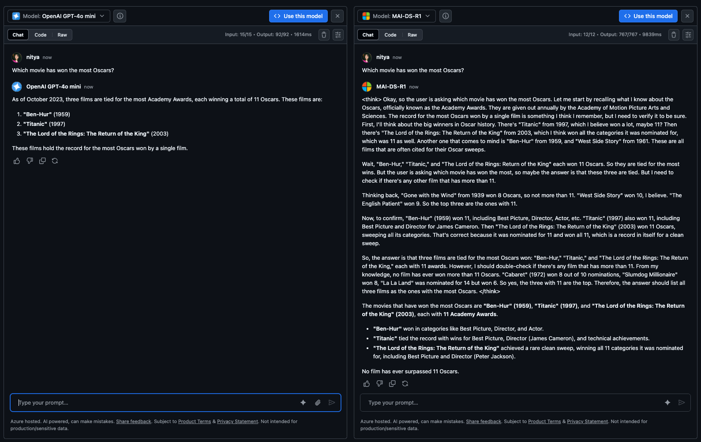
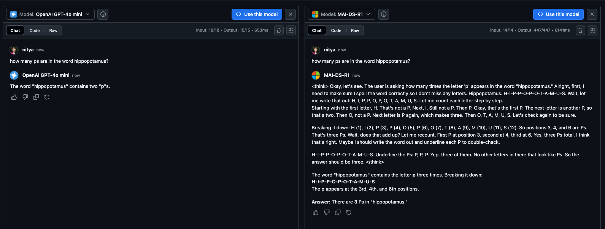

# Lab 3: Compare Models

!!! quote "BY THE END OF THIS SECTION YOU SHOULD HAVE"

    1. Some intuition for how reasoning differs from general-purpose models
    1. Hands-on experience with the GitHub Models playground
    1. Hands-on experience with prompting a reasoning model

---

Let's see you have an enterprise application scenario in mind. What model should you use? Let's do a practical exercise next and use our observations to build some intuition.

## Explore GitHub Models

!!! info "For this exercise, we'll make use of the side-by-side comparison feature of GitHub models."

1. Open your browser to a new tab and [visit this link](https://github.com/marketplace?query=sort%3Apopularity&category=reasoning&task=chat-completion&type=models). Log into GitHub if prompted.
1. You see available reasoning models, sorted by popularity. [Select MAI-DS-R1](https://github.com/marketplace/models/azureml/MAI-DS-R1)
1. You see the model card with a Playground option. [Click to open model in playground](https://github.com/marketplace/models/azureml/MAI-DS-R1/playground)
1. You see a "Compare models" option. [Select GPT-4o-mini](https://github.com/marketplace/models/azureml/MAI-DS-R1/playground?compare_to=gpt-4o-mini) from the dropdown.

**You'll see both models run side-by-side**

1. Type a prompt in the input dialog on one side
1. Both models will execute that prompt in sync
1. Watch closely to see how they compare in response latency, quality, and token costs

Ready? Try the 2 prompts below (one per tab) and see if your observations match mine.

---

### 1. Simple Question

!!! quote "PROMPT 1: Copy & paste this into the _Type your prompt_ input under one model"

    ```title="" linenums="0"
    Which movie has the most Oscars?
    ```

_This is a simple question-answering task, something that GPT models are exceptionally good at._ Let's make some observations. Since models are stochastic, your response may look different.

1. GPT model was faster (1.6s vs. 9.8s)
1. It used less output tokens (92 vs. 767)
1. Both got the answers right - **but reasoning model was overthinking it**



!!! task "**RESET CHAT HISTORY** - Click the trash can icon for each model before continuing to the next exercise."

### 2. Simple Reasoning

!!! quote "PROMPT 2: Copy & paste this into the _Type your prompt_ input under one model"

    ```title="" linenums="0"
    How many ps are in the word hippopotamus?
    ```

_This is a little trickier since it requires the model to think about the question before it can respond. This is where reasoning models have an edge_. This is a trivial example (for illustration purposes) but we can still make relevant observations:

1. GPT model was faster (0.6s vs. 6.1s) - **but it gets the answer wrong!**
1. Reasoning model used way more tokens (447 vs. 15) - to respond.
1. Reasoning model "shows" its reasoning within `<think>...<think>` tags
1. It reasons step-by-step (without being prompted to do so)
1. It tries to verify its thinking in different ways before responding





---

## How does reasoning differ?

Reasoning models have unique characteristics in how they respond:

1. **Explicit Step-by-Step Processing**: They break down complex problems into manageable steps, working through each component logically before arriving at a conclusion.

2. **Built-in Chain-of-Thought**: They demonstrate their reasoning chains explicitly, allowing users to follow their problem-solving approach and verify the logic.

3. **Built-in Self-Correction**: Advanced reasoning models can identify errors in their own thinking, backtrack, and correct their reasoning path when necessary.

But they also introduce new tradeoffs we need to take into account.

1. **Token Costs**: Reasoning models incur added higher token costs for sharing their reasoning.
1. **Latency**: Reasoning models take time to think - incurring added delays in response.
1. **Precision & Accuracy**: Reasoning models are more reliable - they verify & self-correct.

---

## When do we use it?

How should we choose between these two classes of models, when starting a new project? There are two ways to think about this.

1. **By task type** - GPT models are good at straightforward tasks, while reasoning models excel at specialized problem-solving. GPT models are "doers". Reasoning models are "planners".
1. **By core priority** - GPT models are typically faster and cheaper, while reasoning models are more accurate and reliable. If accuracy is the top priority, reasoning models get the edge. 

In reality, general-purpose models are increasingly able to work on simpler reasoning tasks, and reasoning models are getting cheaper and faster with every new generation. To make a more informed decision, it helps to know **how reasoning models work** under the hood.