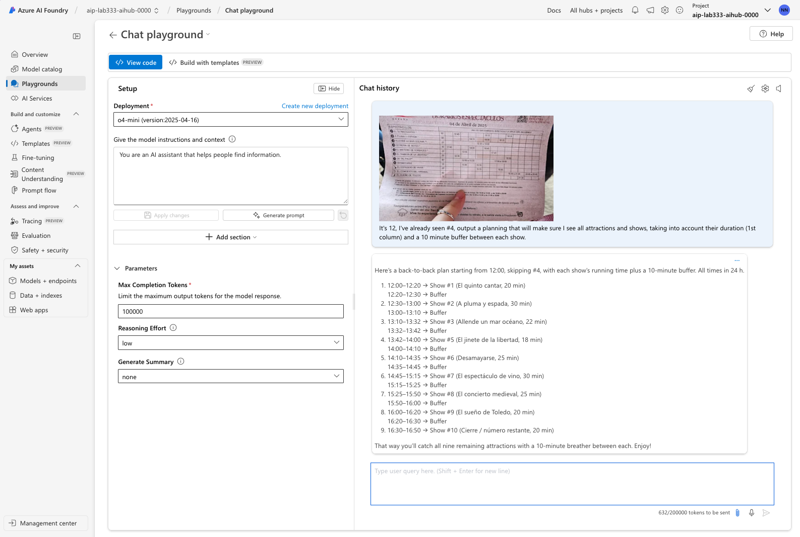
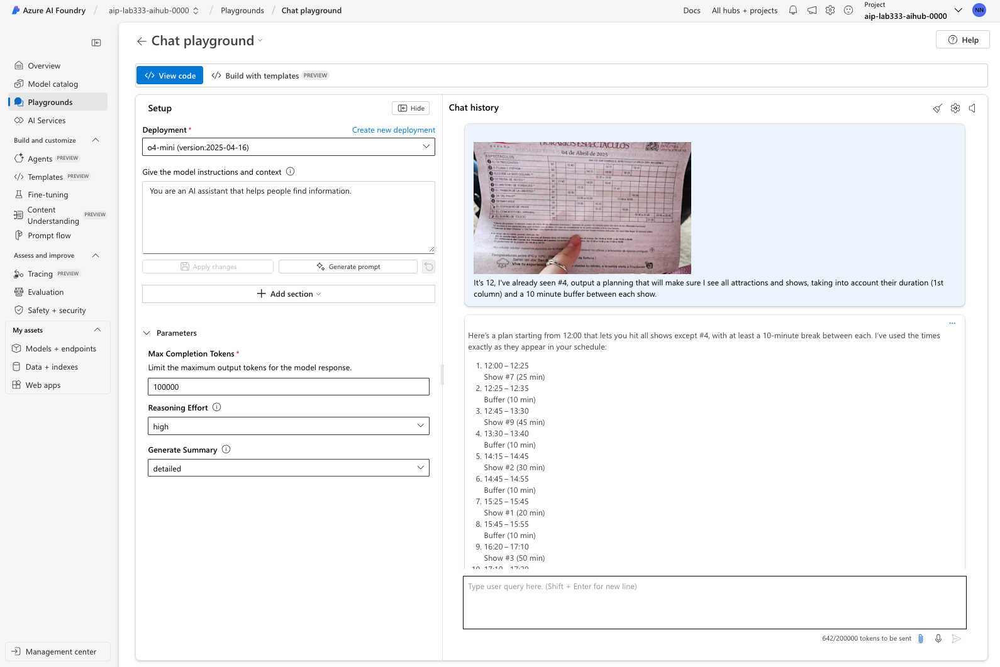
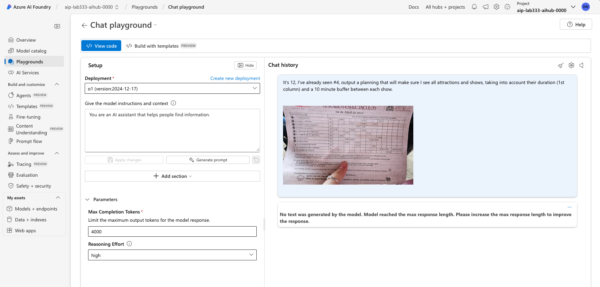

# Lab 4: Manage Tokens

!!! quote "BY THE END OF THIS SECTION YOU SHOULD KNOW"

    1. What reasoning tokens are, and how they relate to inference time scaling
    1. Why token management is critical, and the levers available to influence it 
    1. How to use a trial and error approach to find the right token management strategy

---

Reasoning models are designed to think deep and hard about complex problems - where precision and accuracy of responses are a higher priority. The tradeoff we make is in _response latency_ and _token usage_. In this section, we'll see where these reasoning overheads occur, and what knobs and dials we have to optimize them.

## Reasoning Tokens

Reasoning models work by introducing the idea of [reasoning tokens](https://platform.openai.com/docs/guides/reasoning#how-reasoning-works) as shown below. 

1. These tokens represent the "thinking output" of the model at a given step (turn) 
1. Tokens are not carried over, but they count against the model context window.
1. Increasing the count of reasoning tokens encourages model to "think more"
1. Increasing it too much can cause it to starve output tokens (reducing quality)

    

---

## Token Management

So how do we we strike the right balance between reasoning accuracy (more reasoning tokens) and output quality (fewer reasoning tokens)? We have a few knobs we can turn:

1. Set [max_completion_tokens](https://platform.openai.com/docs/guides/reasoning?api-mode=chat#controlling-costs) to limit the total number of tokens generated per turn - including both _visible_ (output) and _hidden_ (reasoning) tokens.
1. Set [reasoning_effort](https://platform.openai.com/docs/guides/reasoning?api-mode=chat#get-started-with-reasoning) to `low`, `medium`, or `high` based on your requirements. The default is medium - allowing you to move the dial up or down, to optimize for accuracy or cost.
1. Try different reasoning models (e.g., old-vs-new, full-vs-mini). The token cost or response quality may vary even if all other parameters are the same.

This may require trial-and-error strategies. We'll see an example in practice below.

---

## Inference Time Scaling

Let's briefly talk about **inference time scaling** and how it relates to reasoning effort.

1. **Training time compute** refers to the time and resources needed to train the LLM to do reasoning. Training compute is expensive. So, even though increasing training time improves performance, we cannot afford to do so at will (e.g., for specific tasks)
2. **Inference time compute** refers to the time and resources needed to execute a request with that trained model. Inference compute is cheaper than training, and data indicates that giving models more time to think (inference time) may lead to better performance. This makes inference time scaling the more cost-effective way to adapt and grow performance.

Reasoning models can use various strategies to scale inference time, including:

- Increasing count of reasoning tokens (give it more space to think)
- Asking the model to wait (and assess status before it continues)
- Asking the model to explore strategies in parallel (encourage more thought)

---

## Task: Visual Reasoning

Let's revisit the [visual reasoning example](https://openai.com/index/introducing-o3-and-o4-mini/) in the o4-mini release announcement. The use case involves this image of a person holding up a picture with a tour schedule - and uses this prompt: 

!!! quote ""
    It's 12, I've already seen #4, 
    output a planning that will make sure I see all attractions and shows, 
    taking into account their duration (1st column) 
    and a 10 minute buffer between each show.

To explore the levers available to us for token management, let's start with a Playground exercise where we adjust three levers: _reasoning effort, max completion tokens, and choice of reasoning model._

We have two reasoning model deployments in our Azure AI Foundry project: `o1` and `o4-mini`. 

Both models can handle multimodal inputs, so let's try to figure out which one is best for a _visual reasoning_ task based on the tradeoffs between token cost and accuracy. Note that the model is not just describing the picture, it is actively reasoning about how to use that information to fulfill the user's objective.

## Lab Instructions

1. You'll find a copy of this image here: `docs/Workshop/assets/example-o1.webp`. Save the image to your laptop by right-clicking on the image shown above and using the "Save As" action.
1. Use the Azure AI Foundry Playground to test the prompt with each of the models `o1` and `o4-mini` in turn
1. In each step, copy the prompt above into the prompt box (top left)
1. Click the paperclip icon in the prompt box to upload the image above
1. Open the "Parameters" control to set the reasoning effort to the desired level (low, medium, high)
1. Set the max completion tokens to the desired length (100K, 40K, 4K)
1. Run the prompt and observe the response and token usage 

Detailed steps are provided for each model / reasoning effort combination below.

!!! info "**Based on your observations -  what do you feel is the best model for this task?**"

### 1. o4-mini (low)(100K)

1. Use the faster, cheaper o4-mini model with the default max completion tokens (100K)
1. Set reasoning effort to low
1. **Response** took 632 tokens

### 2. o4-mini (high)(100k)

1. Set reasoning effort to high
1. **Response** took 642 tokens
1. _We observe that changing reasoning effort did not improve performance much. This may be because the model was able to get the best answer with the default reasoning effort._

### 3. o1 (high)(40K)

1. Change models to o1 (old-vs-new)(full-vs-mini)
1. Note that o1 suggests lower completion tokens (40K) by default
1. Note that o1 also lacks the _Generate Summary_ parameter
1. _We observe that the model uses more tokens but takes additional effort to provide tips._

### 4.  o1 (high)(4K)

1. Let's lower the max completion tokens to 4K
1. Note that this impacts model's ability to think - no response is generated

### 5. o1 (low)(4K)

1. Keep the max completion tokens at 4K
1. Set reasoning effort to low
1. We do get a response - but it's the most tokens used so far.

---

!!! tip "The main takeaway is to experiment with different models and parameters to find the right balance for your use case. In this case, we see that o4-mini with default (high reasoning) has the best value."

