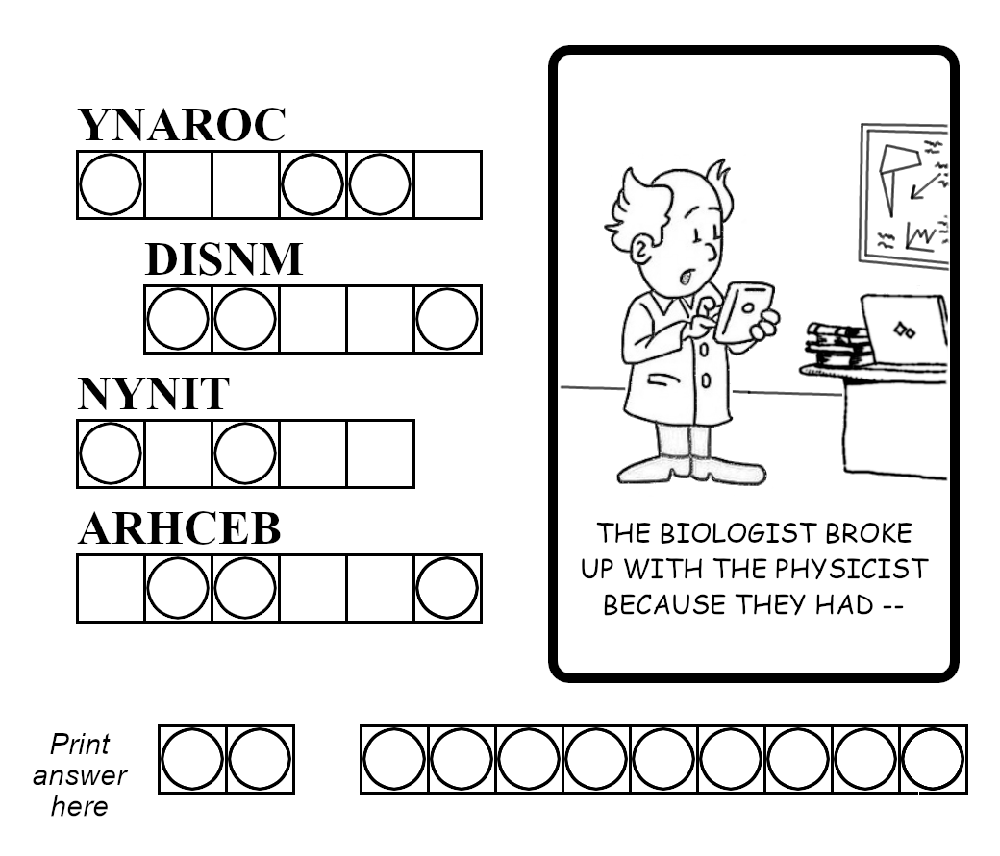

!!! quote "BY THE END OF THIS SECTION YOU SHOULD HAVE"

    1. Some intuition for the difference between visual and text reasoning problems
    1. Some experience using multimodal prompts for visual reasoning in Playground
    1. Some intuition for good visual reasoning problems and prompt engineering them


Visual Reasoning is when the model is not just analyzing the picture (object recognition), it is actively using it for reasoning. This is a fascinating new area for reasoning applications - so let's use this lab to explore a small example.

!!! info "REMINDER: These models are stochastic. Your response may not match the sample exactly"

---

## 1. Prompt

Here is a good example of a visual reasoning challenge - a **word jumble**. The image come from  [this Wikipedia article](https://en.wikipedia.org/wiki/Jumble).

1. Upload the image to the Playground.
1. Use the prompt:

   ```title="" linenums="0"
   "Solve this"
   ```



    
---

## 2. First Response

!!! quote "HOW DID YOUR MODEL RESPOND?"

Here's what we see in the sample response below:

1. It got the answer right: **No Chemistry** 
1. Note that the model was configured for **detailed** response and showed its work
1. The response took 544 tokens with _high_ reasoning effort.
1. It also recognized that the puzzle was humorous (cites the "punchline")


    

## 3. Don't Generate Summary

!!! quote "ITERATE ON THE PROMPT - NOTE YOUR OBSERVATIONS"

1. Repeat (2) but set _generate summary_ option to "none"?
1. Observe what happens now. For example I noticed:
      1. The response took 345 tokens with _high_ reasoning effort.
      1. The output was shorter and less detailed than the previous one

```title="" linenums="0"
First you unscramble each word:

YNAROC → CRAYON
DISNM → MINDS
NYNIT → TINNY
ARHCEB → BREACH

Then you take the letters in the circled positions of each (3 from CRAYON, 3 from MINDS, 2 from TINNY, 3 from BREACH) to get

C Y O  M I S  T N  R E H

Finally you anagram those eleven letters into the punny answer:

NO CHEMISTRY
```

---

## 4. Low Reasoning Effort

!!! quote "ITERATE ON THE PROMPT - NOTE YOUR OBSERVATIONS"

1. Repeat (2) - and also set _reasoning effort_ option to "low"?
1. Some observations:
      - The answer was still correct - but took more (389) tokens

## 5. Continued Conversation

!!! quote "ITERATE ON THE PROMPT - NOTE YOUR OBSERVATIONS"

1. Let's see if the model understand the nuances of this puzzle.
1. Set the reasoning effort to: high
1. Set the generate summary to: yes
1. Try this prompt:

      ```title="" linenums="0"
      "create a new puzzle like that one - and explain how you did it"
      ```

1. Some observations:
      1. The response took  953 tokens with _high_ reasoning effort.
      1. It not only created the puzzle and explained the reasoning, it understood the pattern and made sure there was a punny answer.


??? success "SEE SAMPLE RESPONSE: Click to expand"

      Here’s a “break‑up pun” puzzle along the same lines:

      PUZZLE
      Unscramble each row into an ordinary word. In the finished word, the letters in circled boxes are to be collected (in any order) to spell the two‑word punch‑line.

      O M L A R
      □◯□◯◯
      (unscrambles to ______ )

      P A R E S
      ◯□◯□□
      (unscrambles to ______ )

      A T P I N
      ◯◯□□□
      (unscrambles to ______ )

      C E O N
      □□◯◯
      (unscrambles to ______ )

      CARTOON CAPTION
      “The geologist broke up with the astronomer because they needed ______________.”

      Print the 9 circled letters here:
      □□ □□□□□
      
      SOLUTION SKETCH

      OMLAR → MORAL
      circled letters (positions 1, 2, 3) → M O R
      PARES → SPEAR
      circled letters (positions 1, 3) → S E
      ATPIN → PAINT
      circled letters (positions 1, 2) → P A
      CEON → ONCE
      circled letters (positions 3, 4) → C E
      Collected letters are M O R E S P A C E → “MORE SPACE.”

      So the finished caption reads:
      “The geologist broke up with the astronomer because they needed MORE SPACE.”

      
      HOW I MADE IT

      Pick a short punny phrase (“MORE SPACE”) for the cartoon punch‑line.
      List its letters (M,O,R,E,S,P,A,C,E) and decide how many circles to draw on each of four words (here 3+2+2+2 = 9).
      Choose four everyday words that contain exactly the needed circled letters.
      Scramble each word and mark which positions will be circled.
      Lay out the puzzle with blanks, circles, and the cartoon clue so that solvers unscramble, extract the circled letters, then re‑scramble them into the final joke answer.


---

## 6. Switch Task Focus

!!! quote "STAY IN CONVERSATION BUT SWITCH TASK - NOTE YOUR OBSERVATIONS"

Let's keep the conversation history but use a different image type (webp) and task (calorie estimate). We'll use this image of [a lava cake](https://publicdomainrecipes.com/lavacake/) from the public domain.

1. Upload this `webp` image to the Playground (in the prompt console)
1. Try this prompt:

      ```title="" linenums="0"
      Can you estimate the calories in this?
      ```

1. **Did the model make the context switch to the new task?** Some observations:

      1. The model was able to recognize the image and estimate the calories in it.
      1. It gave a detailed breakdown of ingredients and respective calorie counts.
      1. **Token Cost**: 572


!!! quote "Response"
    
    ``` title="" linenums="0"
      Here’s a rough breakdown based on typical portion sizes:

         • Chocolate “lava” cake (single serving, about 100–120 g): 350–450 kcal
         • Vanilla ice cream (one generous scoop, ~½ cup): 130–180 kcal
         • Berry sauce or coulis (2–3 Tbsp): 30–60 kcal
         • Fresh strawberry slices (3–4 medium berries): 10–15 kcal

         Total estimate: approximately 520–705 kcal

         Depending on exact serving sizes, you’re likely looking at somewhere in the 550–750 kcal range for the entire plate
    ```


## 7. Homework: Try this

!!! quote "EXPLORE AT HOME: Iterate and build intuition for yourself."

Think of ways in which we can make the task more actionable for our needs.

1. **Response Formatting** - can we have it generate the information in form of a nutrition label?
1. **Recipe Suggestion** - can we have it generate a recipe just by looking at the picture?
1. **Visual Reimagining** - can we have it create a new image for the recipe reflecting our style?

??? info "SAMPLE RESPONSE: "Give me a recipe for this that matches the formats of online recipe websites. Provide ingredients prep-time cook-time and step by step instructions (Took 1108 tokens)""


      Molten Chocolate Lava Cakes with Berry Coulis and Fresh Strawberries

      Yields: 4 servings
      Prep Time: 20 minutes
      Cook Time: 12 minutes
      Total Time: 32 minutes

      INGREDIENTS
      For the Lava Cakes
      • 120 g (4 oz) dark chocolate (70% cocoa), chopped
      • 100 g (3½ oz) unsalted butter, plus extra for greasing
      • 2 large eggs
      • 2 large egg yolks
      • 50 g (¼ cup) caster (superfine) sugar
      • 25 g (3 tbsp) plain (all‑purpose) flour
      • Pinch of fine sea salt

      For the Berry Coulis
      • 150 g (5 oz) mixed berries (fresh or frozen; e.g. raspberries, blueberries, blackberries)
      • 2 tbsp granulated sugar
      • 1 tbsp fresh lemon juice
      • 1–2 tbsp water (as needed)

      To Serve
      • 4 scoops high‑quality vanilla ice cream
      • 4 large strawberries, hulled and sliced

      EQUIPMENT
      • 4 × 6 oz (180 ml) ramekins or custard cups
      • Baking tray
      • Small saucepan or double‑boiler setup
      • Whisk, spatula, sieve, and fine‑mesh strainer

      STEP‑BY‑STEP INSTRUCTIONS

      Preheat & prepare ramekins
      – Preheat the oven to 200 °C (400 °F).
      – Generously butter each ramekin, then dust with a little sugar, tapping out any excess. Set ramekins on a baking tray.

      Melt chocolate & butter
      – In a heatproof bowl set over (but not touching) simmering water, combine chopped dark chocolate and butter.
      – Stir occasionally until fully melted and smooth. Remove from heat and let cool for 2 minutes.

      Whisk eggs & sugar
      – In a separate bowl, whisk together whole eggs, yolks, sugar, and salt until pale, thick, and ribbon‑coating (about 2–3 minutes).

      Combine chocolate mixture
      – Gently fold the melted chocolate/butter into the egg mixture using a rubber spatula. Mix until just combined.

      Fold in flour
      – Sift the flour over the batter, then fold in lightly until no streaks of flour remain. Be careful not to overmix.

      Fill ramekins & bake
      – Divide batter evenly among the prepared ramekins.
      – Bake on the center rack for 10–12 minutes, until the edges are set but the centers still jiggle slightly when shaken.

      Rest briefly
      – Remove from oven and let rest for 1 minute. Run a small knife around the edge of each cake, then invert onto individual serving plates.

      Make the berry coulis
      – In a small saucepan, combine berries, sugar, and lemon juice. Cook over medium heat until the fruit breaks down and releases its juices (3–5 minutes).
      – Add water by the tablespoon if mixture seems too thick.
      – Strain through a fine‑mesh sieve into a bowl, pressing on solids to extract as much sauce as possible. Discard seeds.

      Plate & garnish
      – Using the back of a spoon, swoosh about 2–3 tbsp of coulis in a circle on each plate.
      – Place the warm lava cake in the center of the coulis swirl.
      – Top each cake with a scoop of vanilla ice cream.
      – Arrange sliced strawberries alongside or on top.

      Serve immediately
      – The contrast of warm, gooey chocolate and cold ice cream is best enjoyed right away.

      TIPS
      • To make ahead: Assemble batter in ramekins, cover tightly, and refrigerate up to 24 hours. Add 1–2 extra minutes to baking time if chilled.
      • For an extra flourish: Dust with icing sugar or sprinkle a few fresh mint leaves.