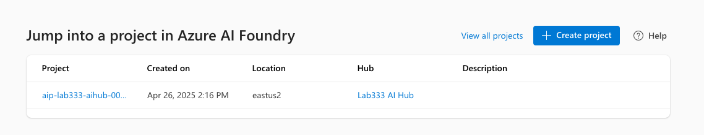
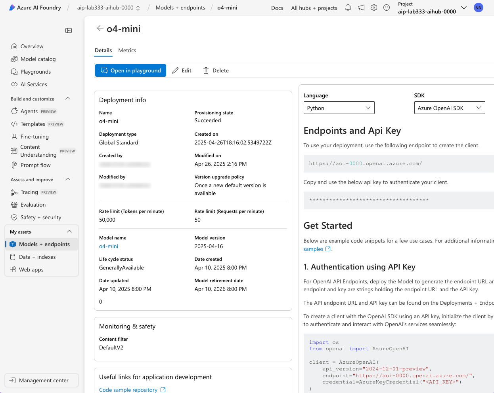

# Lab 2: Validate Setup

!!! quote "BY THE END OF THIS LAB YOU SHOULD HAVE"

    1. Accessed Azure Portal and verified resources were provisioned
    1. Accessed Azure AI Foundry portal and verified models were deployed
    1. Activated the Azure AI Foundry playground for future use

---

## 1. View Azure Resources

**The Azure Portal** is the web-based interface for managing Azure resources. It provides a unified view of all your Azure resources, including those provisioned by Azure AI Foundry. Let's verify that the resource group was provisioned correctly.


1. Visit [this Azure Portal link](https://portal.azure.com/#browse/resourcegroups) in a new browser tab.
    - You should the `rg-lab-reasoning` resource group listed. Click the link.
    - You should see something like this

        

1. Check that you have these resources provisioned
    - [X] Azure AI hub resource 
    - [X] Azure AI project resource t
    - [X] Azure AI services resource
    - [X] Key vault
    - [X] Storage account

---

## 2. View Azure AI Project

The **Azure AI Foundry portal** is a specialized interface for working with Azure AI Foundry projects. It provides a UI-based (low-code) way to interact with your Azure AI applications. 

**Let's take a quick tour of the portal to get familiar with features**.

1. Navigate to [this Azure AI Foundry portal link](https://ai.azure.com) in a new browser tab.
    - The landing page lists your active Azure AI Foundry projects.
    - You should see at least one project listed now, as shown.

        

1. Click the listed project to visit the project Overview page.

    - This page gives you all configuration information needed for code-first access.
    - The sidebar also shows you UI-based tools & services for working with the project.

        

---

## 3. View Model Deployments

**AI Models are the core engines of your Azure AI Foundry project**. Let's verify that all required models were provisioned correctly.

1. Click the **Models + endpoints** item in the sidebar
    - This model deployments page lists currently deployed models for the project.
    - Check that you have these three models deployed, as shown.
        - [X] General Purpose (popular) - `gpt-4o-mini`
        - [X] Reasoning (old, capable) - `o1`
        - [X] Reasoning (new, fast, cheap) - `o4-mini`

    


1. Next, let's explore the model details page to learn what it provides.
    - Click on one of the models in the list - e.g., click `o4-mini`
    - You see the details page below (with code samples & config info)
    - You see a metrics tab - this has stats on token usage, request rate etc.
    - Click the link under **Model name** to visit the model card.

        

1. Next, let's locate the **model card** for this model.
    - Click the `o4-mini` link under **Model name** to get the model card (below)
    - This gives details on the model capabilities, pricing, and performance.
    - We're using _Global Standard_ model deployments (pay-as-you-go pricing)
    - Scan the **variants** to see how this compares to its peer reasoning models.

        

**The Azure AI Foundry portal is invaluable during the Ideation phase of our project.**

You can explore the model catalog, assess models with benchmarks, and deploy a select few for closer inspection before making the final selection for development.

---

## 4. Explore The Playground

The **Model Playground** is a low-code interface for exploring and testing models. Quickly prototype ideas, test prompts, and evaluate model performance - all without writing code.

1. Click on the **Playgrounds** option in the menu sidebar to get started

    - Click "Try the Chat playground" (this is a one-time activation)

        

    - You can then select any deployed model for interactive exploration

        

1. We have 2 reasoning models and 1 general-purpose model available for testing.

    - Let's explore the `gpt-4o-mini` model (we'll use reasoning models later)
    - Select a default prompt - e.g., I selected the **Poetry generation** option
    - Click the arrow - note the response and the token usage (below the prompt box)
    - Expand the **Parameters** section - vary settings to assess response quality

        

!!! task "HOMEWORK: Things you can try on your own later"

    - Vary **Max Response** & retry prompt - how did the response change?
    - Change the model & retry prompt - how do reasoning models differ?
    - Observe impact on response quality, latency & token cost in each case

**You just saw how easy it is to experiment with models and ideate in the Playground. This is how you build intuition for how a model works, and how to make it work effectively.**


---

## 5. Configure Local Environment

Ideation is good for assessing models for your project. But once you've made a decision, you need to move to a code-first approach for development. Let's set ourselves up now so we can explore code-first development later.


1. Open the VS Code Terminal. Make sure you are at the root folder
1. Copy the `.env.sample` file to a `.env`

    ``` title="" linenums="0"
    cp .env.sample .env
    ```

1. Return to the Azure AI Foundry portal and click on **Overview** in sidebar

1. Copy over the values from that page, to update the `.env` file

    - `AZURE_OPENAI_KEY` - set the value from the `API Key` panel
    - `AZURE_OPENAI_ENDPOINT` - set the value from the `Endpoint` panel

**You are now ready to start exploring reasoning models from both playground and code**

---